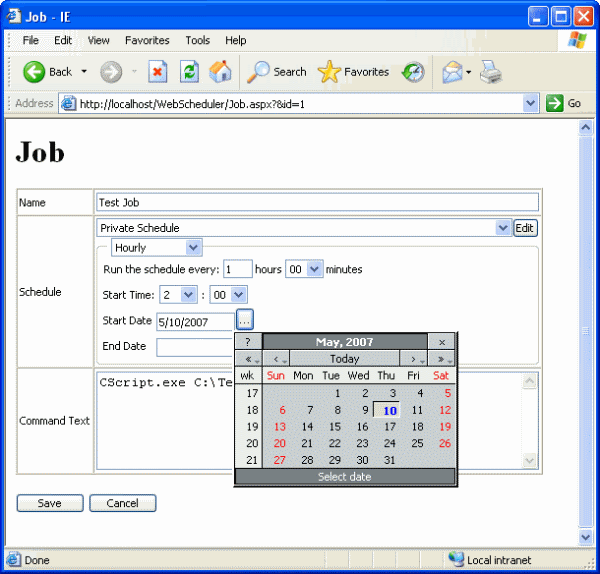
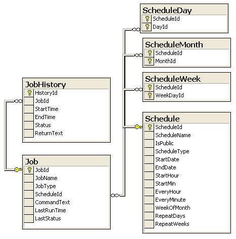

# Web Based Job Scheduler

Originally posted here:
https://www.codeproject.com/Articles/18759/Web-Based-Job-Scheduler

A complete VB.NET application to schedule DOS command tasks online

## Introduction
There are many ways to schedule a task on a web server. For example, you can use Windows Task Scheduler and SQL Server Agent. This application is unique in that you can:
1. schedule jobs using a web browser
2. extend the scheduling application to include your own features

## Using the Code
This application has three components:

A Windows Service that will run a job (DOS command text)
A Web Application that will let you schedule a job
MS SQL Server database Stored Procedure to get the list of jobs that need to run
Job and schedule information are stored in a MS SQL Server database. The web application lets you create a job with a private or a shared schedule. A shared schedule makes scheduling jobs more manageable. The scheduler supports seven schedule types:

- Hourly	Run the schedule every hour
- Daily	Run job after a number of days
- Weekly	Run job on the following weekdays (Monday, Tuesday, etc.)
- Weekly skip	Run job on the following weekdays (Monday or Tuesday) skipping every other week
- Week number	Run job on the following weekdays (Monday or Tuesday); second week of month on the following months (January, February)
- Calendar	Run job on the following days (1st, 2nd, and the last day of the month); on the following months (January, February)
- Run once
  
Each schedule type supports a time window with a start and end time.

Below is the Entity Relationship Diagram for the database:

The Windows Service has a timer that fires every minute. The event calls the GetJobsToRun Stored Procedure that lists the jobs that need to run. As each job runs, 
LastStatus and LastRunTime are updated. Also, the JobHistory table keeps the history of every time a job runs.

A free third-party calendar component is used from dynarch.com.

## Deployment
Here are the steps to deploy this application:

1. Connect to SQL Server and create a database called JobScheduler.
2. Add a user to the database that would have write access.
3. Open the SQL folder. Run ScheduleSchema.sql against your database.
4. Run GetJobsToRun.sql against your database.
5. Copy the WebScheduler folder to C:\Inetpub\wwwroot\ and make it a virtual directory.
6. Double click on the C:\Inetpub\wwwroot\WebScheduler\connect.udl file and point it to the JobScheduler database. Test the connection and click OK.
7. Copy the WinJobService folder to your programs folder.
8. Double click on the <Programs Folder>\WinJobService\connect.udl file and point it to the JobScheduler database. Test the connection and click OK. (You can also copy the file you made in step #6 to this location.)
9. Open the WinJobService (WinJobService\WinJobService.sln) project in Microsoft Visual Studio .NET 2003 and compile it.
10. Register the server by running the Service registration script: WinJobService\bin\Install.vbs. You can uninstall the service later by running Uninstall.vbs.

